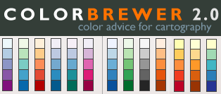

# Tulane Introduction to Python for Data Visualization Workshop Resources
Workshop materials and data visualization resources for the Introduction to Python for Data Visualization Workshop at Tulane University Howard-Tilton Memorial Library

**Python package dependencies:** `numpy` `pandas` `jupyter` `matplotlib` `seaborn` `plotly`. If you have installed Python through the Anaconda Python distribution then all of these packages will be installed except `plotly`. To install `plotly` run `conda install package-name` in your terminal. 

## Table of Contents

1. [Workshop Review](#review)
1. [Jupyter Notebook References](#jupyter)
2. [Gathering and processing data with Python](#data)
3. [Color in Data Visualization](#color)
4. [References](#references)
5. [License](#license)

<a name="review"/>

## Workshop Review

The first half of the workshop, including the introduction to Python, as well as plotting using the `matplotlib` library, is primarily based on the Software Carpentries workshop: [Plotting and Programming in Python](http://swcarpentry.github.io/python-novice-gapminder/). Please review lesson one (Running and Quitting) through lesson nine (Plotting) for a thorough review of the materials covered during the workshop. 

For more background in developing foundational coding and data science skills please refer to other lessons available through the Software Carpentries: https://software-carpentry.org/lessons/

<a href="https://software-carpentry.org/lessons/">
         

<a name="jupyter"/>

## Jupyter Notebook References

<a name="color"/>

## Color in Data Visualization

The essential tool for selecting color maps is [ColorBrewer](http://www.colorbrewer2.org)

### Choosing the right colormap for visualization

